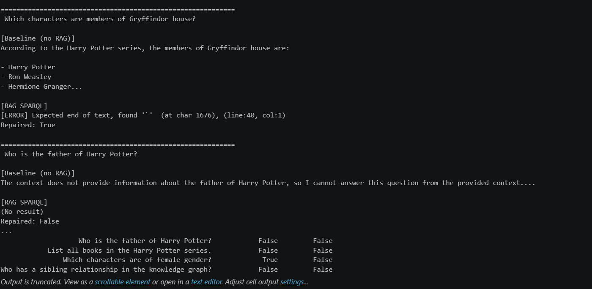

# Harry Potter Knowledge Graph

A full pipeline: data acquisition → RDF graph → SWRL reasoning → KGE → RAG (NL→SPARQL).

---

## Installation
```bash
pip install -r requirements.txt
python -m spacy download en_core_web_sm
```

For RAG, install and start Ollama:
```bash
# Download: https://ollama.com
ollama serve
ollama pull gemma:2b
```

---

## Project Structure
```
project-root/
├── notebooks/
│   └── projet_harry_potter.ipynb   # Main pipeline
├── kg_artifacts/
│   ├── hp_expanded_kb.ttl          # Expanded KB (57k+ triples)
│   ├── hp_knowledge_graph.ttl      # Initial RDF graph
│   ├── alignment.ttl               # Predicate alignment
│   └── hp_expanded.nt              # NT format
├── data/
│   ├── train.txt                   # KGE training split (80%)
│   ├── valid.txt                   # KGE validation split (10%)
│   └── test.txt                    # KGE test split (10%)
├── models/
│   ├── transe/                     # Trained TransE model
│   └── distmult/                   # Trained DistMult model
├── reports/
│   └── kge_comparison.png
├── family.owl                      # OWL ontology for SWRL Part 1
├── requirements.txt
├── .gitignore
└── README.md
```

---

## How to Run

Run the notebook cells in order from top to bottom.

**Module 1 — Data Acquisition** (cells 5–6)
Queries Wikidata SPARQL to collect Harry Potter characters, books, and family relations.

**Module 2 — NER** (cells 8–10)
Applies spaCy NER on HP character descriptions. Illustrates 3 ambiguity cases.

**Module 3 — KB Construction** (cells 12–13)
Builds the RDF graph with custom ontology (classes + object/datatype properties).

**Module 4 — Alignment** (cells 15–16)
Aligns private predicates to Wikidata properties via `owl:equivalentProperty`.

**Module 5 — KB Expansion** (cell 19)
Loads the pre-expanded KB from `hp_expanded_kb.ttl` (57,902 triples).
To re-run the expansion from scratch, replace cell 19 with the SPARQL expansion code.

**Module 6 — SWRL Reasoning** (cells 23–25)
- Part 1: infers `OldPerson` from `age > 60` on `family.owl`
- Part 2: infers `hasBrother` from `hasSibling + gender=male` on the HP KB

**Module 7 — KGE** (cells 27–36)
Trains TransE and DistMult via PyKEEN. Evaluates MRR, Hits@1/3/10. Includes size-sensitivity analysis and t-SNE visualization.

**Module 8 — RAG NL→SPARQL** (cells 40–45)
Converts natural language questions to SPARQL using Ollama (gemma:2b). Includes self-repair mechanism and baseline vs RAG evaluation on 5 questions.

---

## KB Statistics

| Metric | Value |
|---|---|
| Total triples | 57,902 |
| Unique entities | 19,018 |
| Unique relations | 180 |

---

## Ollama Setup (RAG module)

1. Download Ollama from https://ollama.com
2. Run `ollama serve` in a terminal (keep it running)
3. Pull the model: `ollama pull llama3`
4. The notebook will connect automatically to `http://localhost:11434`

## Screenshot

